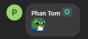

# betterfbgg
BetterFB.gg enhances Facebook Gaming with new emotes.

## Currently supported browsers:

# Get started [PL]
### 1. Pobierz najnowszą wersję i rozpakuj pliki

### 2. Przejdź do ustawień rozszerzeń w twojej przeglądarce

- Chrome: chrome://extensions
- Chromium: chrome://extensions
- Opera: opera://extensions
- Brave: brave://extensions
- Edge: edge://extensions

### 3. Wybierz opcję 'Załaduj rozpakowane'

Jeśli nie widzisz takiej opcji w menu rozszerzeń, musisz włączyć Tryb programisty/dewelopera w swojej przeglądarce

 

### 4. Wskaż na wcześniej rozpakowany folder z plikami
### 5. Ciesz się nowymi emotkami na fb 

